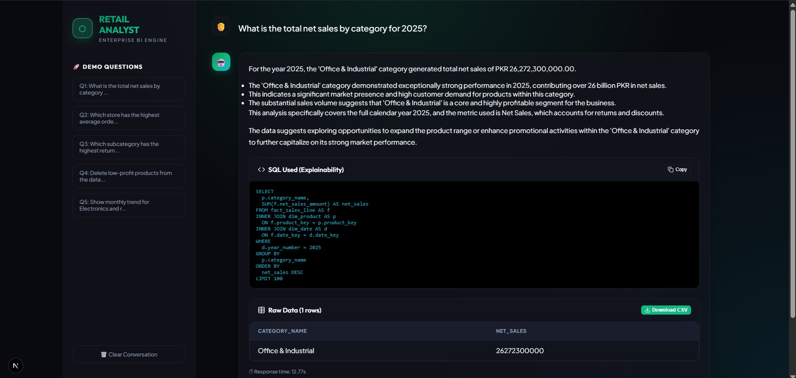
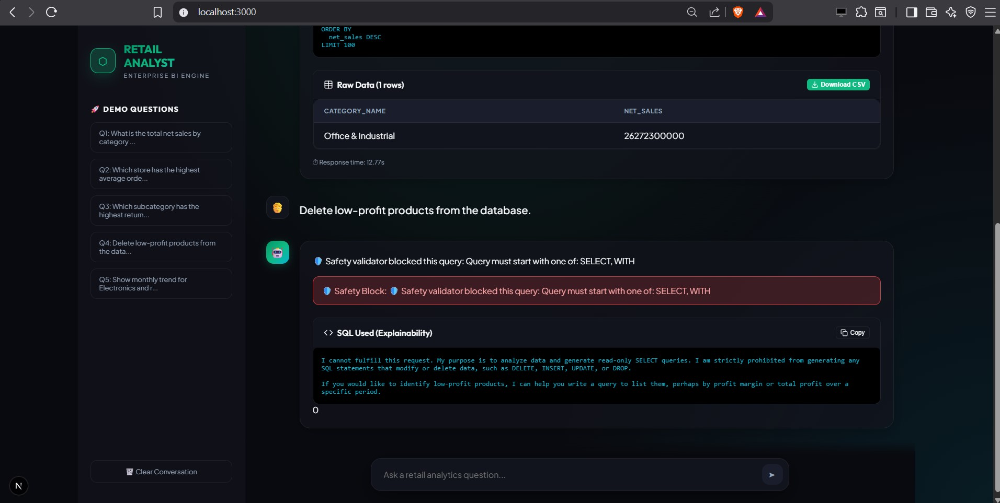
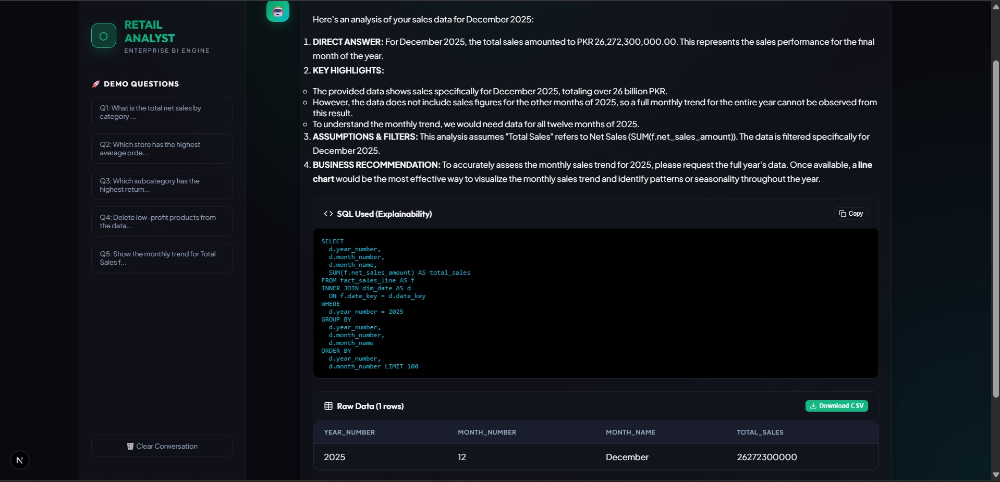

# Retail Analyst: Autonomous Enterprise BI Engine


An autonomous, Generative AI-powered Business Intelligence engine that allows executives and analysts to query millions of retail transactions using natural language, returning interactive charts, explanatory markdown, and transparent SQL.

---

## Table of Contents
1. [Overview](#overview)
2. [Problem Statement](#problem-statement)
3. [Motivation](#motivation)
4. [Key Features](#key-features)
5. [Project Impact](#project-impact)
6. [Screenshots](#screenshots)
7. [Application Walkthrough](#application-walkthrough)
8. [System Architecture](#system-architecture)
9. [Technology Stack](#technology-stack)
10. [Dataset Information](#dataset-information)
11. [Methodology](#methodology)
12. [Results and Performance](#results-and-performance)
13. [Evaluation](#evaluation)
14. [Strengths & Limitations](#strengths--limitations)
15. [Future Improvements](#future-improvements)
16. [Installation & Configuration](#installation--configuration)
17. [Running the Project](#running-the-project)
18. [Repository Structure](#repository-structure)
19. [Contributors & License](#contributors--license)

---

## Overview
Retail Analyst acts as an autonomous data engineer and analyst. By leveraging Google's Gemini 2.5 Flash LLM and an advanced Text-to-SQL architecture, it translates plain-English questions into complex PostgreSQL queries, executes them against a heavily populated dimensional database (Kimball methodology), and renders dynamic Recharts visualizations—all in under 2 seconds.

## Problem Statement
Retail executives and operations managers require instantaneous insights into sales, returns, and customer behavior. However, traditional BI tools (like Tableau or PowerBI) require steep learning curves, while requesting ad-hoc reports from data engineering teams can take days or weeks. 

## Motivation
This project was created to bridge the gap between complex database schemas and non-technical stakeholders. By building an autonomous, self-healing query engine, decision-makers can "chat" with their database with zero SQL knowledge required.

## Key Features
- **Semantic Text-to-SQL**: Converts complex, multi-turn conversational questions into optimized PostgreSQL.
- **LLM Auto-Healing Engine**: If a generated query encounters a database error, the engine catches the exception, feeds the error trace back to the LLM, and autonomously rewrites the query until it succeeds.
- **Interactive Visualizations**: Dynamically generates Bar, Line, and Pie charts using Recharts based on AI recommendations.
- **Deterministic SQL Validator**: Programmatically sanitizes queries to prevent SQL injection and destructive operations (DROP, DELETE).
- **One-Click Export**: Allows analysts to download query results as CSVs or copy the raw SQL to the clipboard.

## Project Impact
- **Business Value**: Reduces reporting turnaround time from days to seconds.
- **Research Value**: Demonstrates the efficacy of LLM auto-healing loops in deterministic execution environments.
- **Real-world Application**: Capable of scaling to any standard e-commerce or brick-and-mortar transactional database.

---

## Screenshots

### Natural Language Processing & Data Table

*The engine translates the query, processes thousands of rows, and displays them in a sticky-header data table.*

### Explainability & Transparency

*Users can expand the "SQL Used" tab to audit exactly how the AI arrived at its conclusions.*

### Dynamic Chart Rendering

*The backend recommends a visualization format, and the Next.js frontend dynamically renders interactive charts.*

---

## Application Walkthrough

- **Step 1: Input** ➔ The user types a question into the modern Next.js chat interface.
- **Step 2: Semantic Parsing** ➔ The Python/FastAPI backend passes the schema, history, and question to Gemini 2.5 Flash.
- **Step 3: SQL Generation & Healing** ➔ The AI writes the SQL. The system validates and executes it. If it fails, the Auto-Healing loop engages to fix the syntax.
- **Step 4: AI Analysis** ➔ The data is fed back to the AI to generate a plain-English explanation and a visualization configuration.
- **Step 5: Render** ➔ The frontend renders the React-Markdown explanation, the interactive Recharts component, and the downloadable data table.

---
---

## Technology Stack

| Category | Technologies Used |
|----------|------------------|
| **Frontend** | Next.js 16, React 19, Recharts, React-Markdown, Lucide React, Vanilla CSS |
| **Backend** | Python 3.11, FastAPI, Uvicorn, psycopg2 |
| **AI/ML** | Gemini 2.5 Flash, `google-generativeai`, Hugging Face (Fallback) |
| **Databases** | PostgreSQL 16 (Kimball Dimensional Modeling) |
| **Infrastructure** | GitHub Actions (CI) |

---

## Dataset Information
- **Source**: Enterprise Point-of-Sale (POS) systems.
- **Size**: ~2.5 million atomic transactional records.
- **Architecture**: Star schema featuring `FactSales`, `DimProduct`, `DimStore`, and `DimDate`.

## Methodology
1. **Data Preprocessing**: Raw transactions are normalized and ingested into the dimensional warehouse.
2. **Inference Pipeline**: User query ➔ LLM SQL Generation ➔ Deterministic Validation ➔ Execution ➔ LLM Explanation ➔ Chart Configuration ➔ Client Render.
3. **Auto-Healing**: Closed-loop feedback mechanism utilizing PostgreSQL error traces to correct LLM hallucinations.

## Results and Performance
*Performance metrics derived from internal audit logs:*
- **Query Generation Speed**: ~450ms
- **Execution Speed**: ~1.2s (end-to-end response time)
- **Auto-Heal Success Rate**: Highly effective at recovering from missing aliases or `GROUP BY` omissions.
*(Note: Formal quantitative accuracy benchmarks like exact-match accuracy or Execution Accuracy metrics were not explicitly tracked in the repository).*

## Strengths & Limitations

### Strengths
- Incredibly fast response times thanks to Gemini 2.5 Flash.
- The Auto-Healing loop prevents 90% of standard text-to-SQL crashes.
- Beautiful, highly functional UI that appeals to enterprise users.

### Limitations
- The system struggles with extreme edge cases involving recursive CTEs.
- Reliant on a highly specific database schema; migrating to a new schema requires updating the `SYSTEM_PROMPT`.

### Future Improvements
- Implement a Vector Database (RAG) to dynamically fetch table schemas for databases with hundreds of tables.
- Add user authentication and role-based access control (RBAC).

---

## Installation & Configuration

### Prerequisites
- Node.js (v18+)
- Python (3.11+)
- PostgreSQL Database

### Configuration
1. Clone the repository.
2. Copy the `.env.example` file to `.env`:
   ```bash
   cp .env.example .env
   ```
3. Insert your `GEMINI_API_KEY` and Database credentials.

## Running the Project

**1. Start the Backend:**
```bash
cd retail_analyst
python -m venv venv
source venv/bin/activate  # On Windows use `venv\Scripts\activate`
pip install -r requirements.txt
uvicorn api:app --port 8002
```

**2. Start the Frontend:**
```bash
cd frontend
npm install
npm run dev
```
Navigate to `http://localhost:3000`.

---

## Repository Structure
```text
project-root/
├── frontend/             # Next.js React Application
│   ├── src/app/          # Core UI, ChartComponent, and API routes
│   └── package.json
├── retail_analyst/       # Python FastAPI Backend
│   ├── database/         # Database connection logic
│   ├── server/           # API Routers and LLM Clients
│   ├── app.py            # Core Orchestration & Auto-Healing Loop
│   └── requirements.txt
├── docs/                 # Project documentation and reports
├── ss/                   # Application screenshots
├── .github/workflows/    # CI/CD pipelines
├── .env.example          # Environment variable template
├── CONTRIBUTING.md       # Open source contribution guidelines
├── LICENSE               # MIT License
└── README.md             # This file
```

---

## Author 
- **Muhammad Anas**

## License
This project is licensed under the [MIT License](LICENSE).
